# Quoridor
2학년 JAVA 프로그래밍 프로젝트

## 프로그램 실행
src/Game.java 실행

## 게임 방식
- 마우스 클릭을 통해 돌을 주변 칸으로 움직이거나 장애물을 설치한다.
- 돌의 이동 경로에 장애물이 있는 경우 넘어갈 수 없다.
- 돌의 이동 경로에 상대방 돌이 있는 경우 넘어갈 수 있다.
- 상대방보다 먼저 시작 지점의 반대편 끝으로 돌을 이동시키면 승리한다.

### 돌의 이동
회색 영역을 선택하여 돌을 이동할 수 있다.
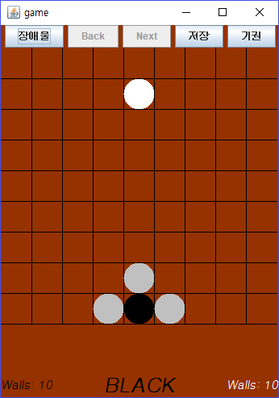 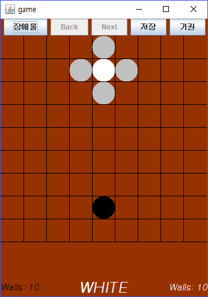

### 장애물 설치
장애물 버튼을 누른 뒤, 마우스 클릭을 통해 장애물을 선택할 수 있다.
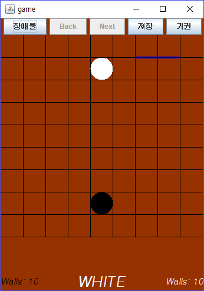 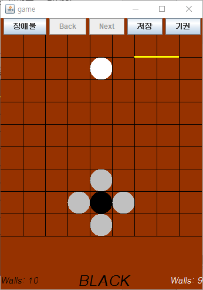

장애물을 설치하면 돌이 장애물을 넘어 갈 수 없다.
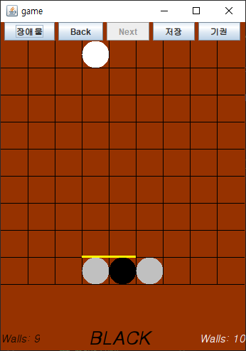

### 턴 이동
Back, Next 버튼을 눌러서 턴을 이동할 수 있다. 1인 플레이에서만 지원한다.
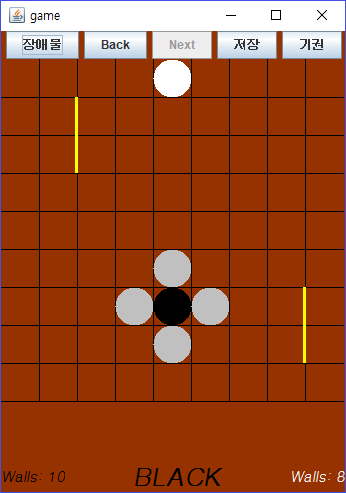 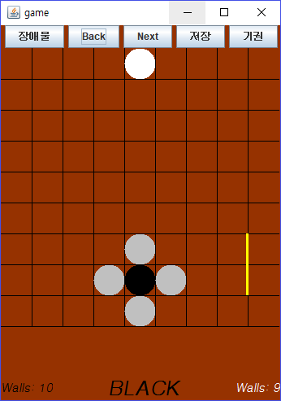 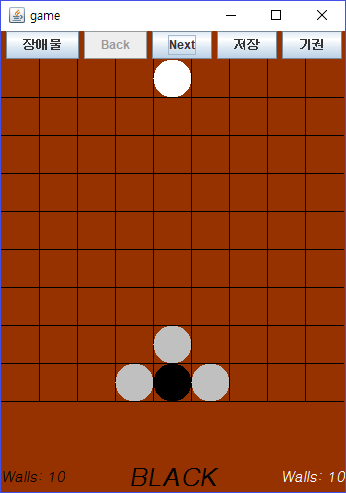

### 온라인 대전
ip 주소를 통해 클라이언트가 서버에 접속하여 게임을 진행 할 수 있다.
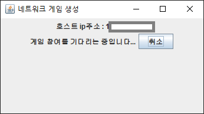 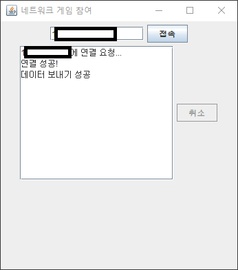
다음은 흰색의 차례일 때의 온라인 대전 게임 화면이다.
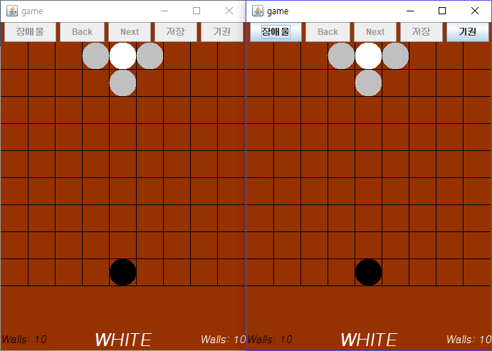

### 진행중인 게임 저장
진행중인 게임을 저장하였다가 불러와서 재개할 수 있다.
#### 턴 진행
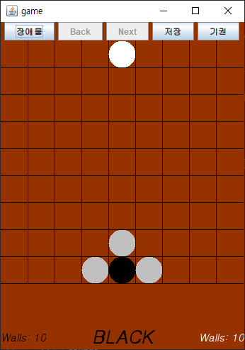 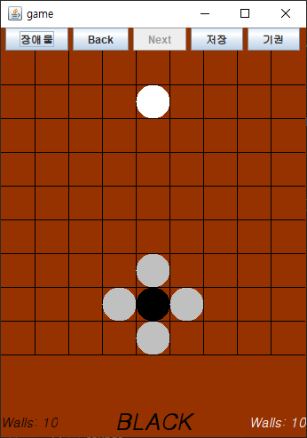 
#### 저장

#### 불러오기

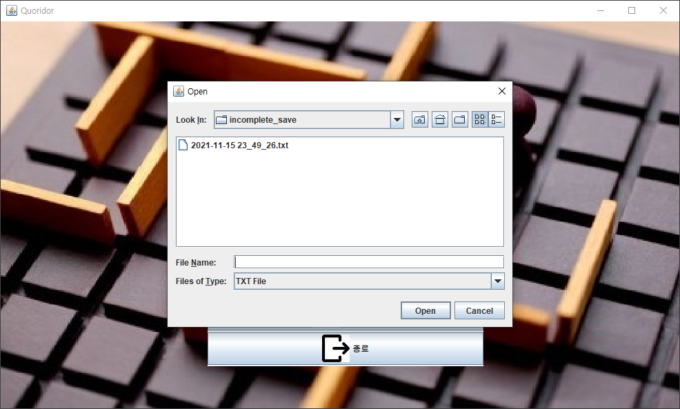
#### 불러와서 되돌리기 진행
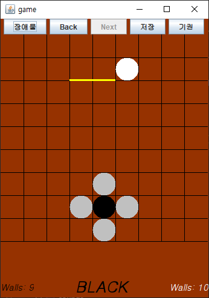 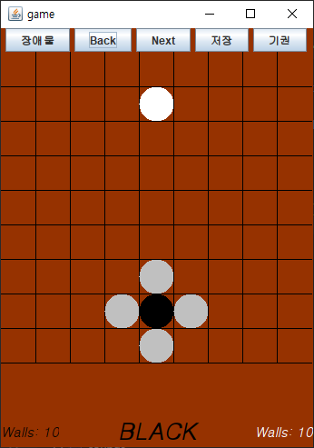 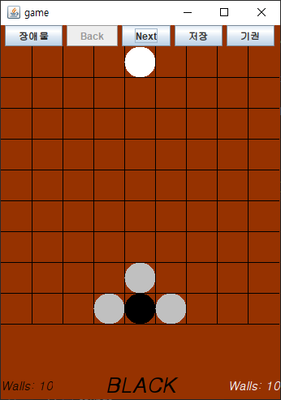

### 완료된 게임 저장
완료된 게임을 저장하였다가 복기 할 수 있다.

#### 불러오기
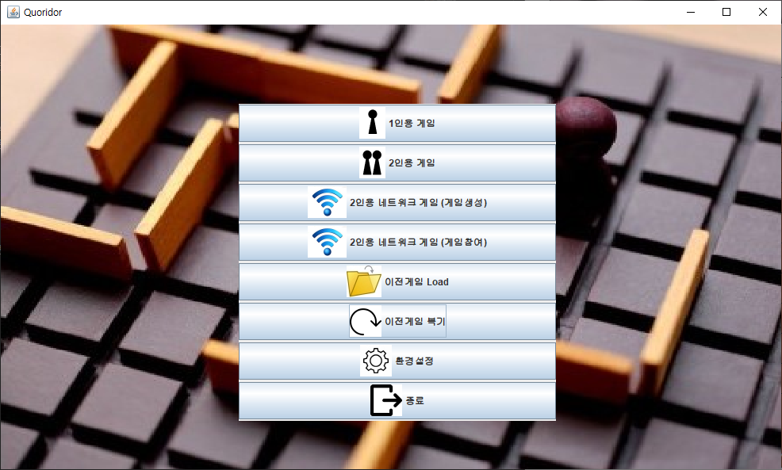

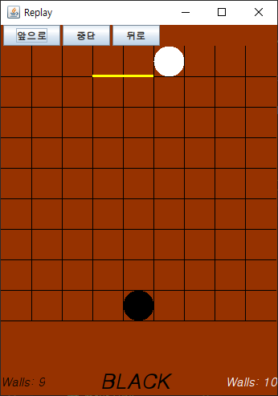 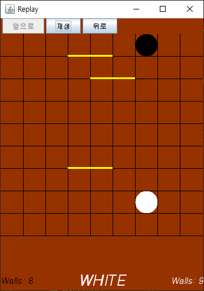

### 환경설정
환경설정 창에서 게임 설정을 변경할 수 있다.
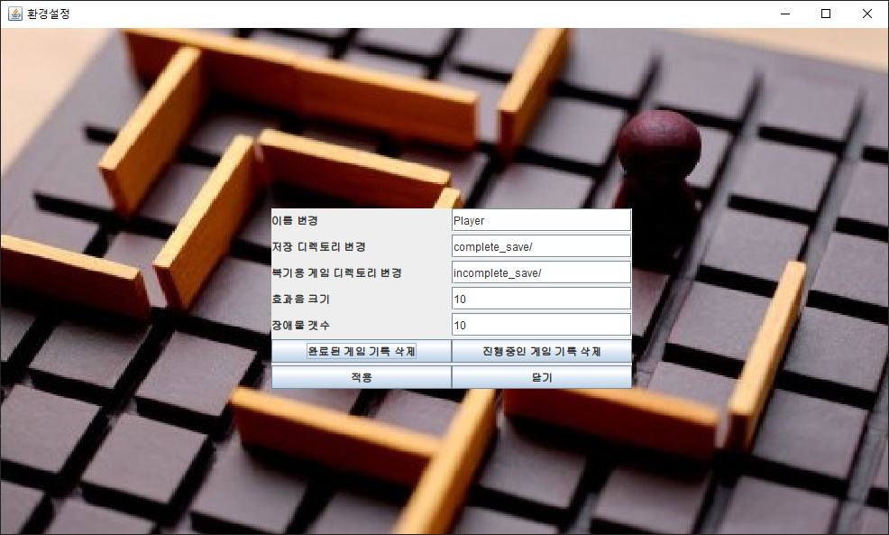